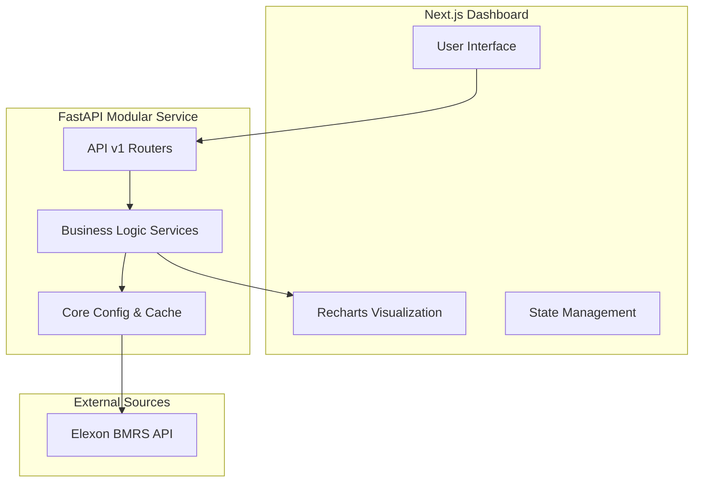

# Wind Forecast Monitor 🌬️🔋

A visually stunning and data-centric application to track the accuracy of the UK's National Grid wind generation forecasts. Built as a full-stack solution with **FastAPI** and **Next.js**, leveraging live data from the **Elexon BMRS API**.

---

## 🌐 Live Resources

- **Frontend Dashboard**: [wind-forecast-monitor-one.vercel.app](https://wind-forecast-monitor-one.vercel.app/)
- **Backend Health Check**: [wind-forecast-monitor.onrender.com/api/v1/health](https://wind-forecast-monitor.onrender.com/api/v1/health)

---

## 🚀 Overview

The **Wind Forecast Monitor** allows grid operators and analysts to visualize the delta between "Actual" wind generation and "Forecasted" generation. It specifically addresses the complexity of varying data resolutions, aligning 30-minute actuals with 60-minute forecasts through linear interpolation.

### Key Features
- **Interactive Dashboard**: High-fidelity time-series charts using **Recharts**.
- **Dynamic Horizons**: View forecasts from 1 to 48 hours in advance using a real-time slider.
- **Strict Compliance**: Locked to the January 2024 dataset as per challenge requirements.
- **Clean Tech Aesthetic**: Modern UI with a focus on data clarity, built with Tailwind CSS.
- **Mathematical Analysis**: Integrated Jupyter notebook for calculating MAE, Median, and P99 error metrics.

---

## 🏗️ Architecture



---

## 🛠️ Tech Stack

- **Backend**: FastAPI, Pandas (Data Wrangling), Pydantic Settings, HTTPX, Cachetools.
- **Frontend**: Next.js 16 (App Router), Tailwind CSS, Lucide React, Recharts.
- **Analysis**: Jupyter Notebook, Plotly.

---

## 📂 Project Structure

```text
.
├── api/                # FastAPI Backend Workspace
│   ├── main.py         # Entry point (uvicorn wrapper)
│   ├── .env            # Environment configuration
│   └── src/            # Modular Source Code
│       ├── api/v1/     # Versioned REST Routers
│       ├── services/   # Alignment, Elexon, & Metrics logic
│       ├── core/       # Pydantic Settings & Global Config
│       └── schemas/    # Pydantic Models (Type Safety)
├── app/                # Next.js Frontend Workspace
│   ├── src/components/ # Dashboard UI Components
│   └── src/app/        # Next.js Pages & Layouts
├── analysis/           # Exported Reports
│   └── analysis_report.html # Exported HTML Report
├── wind_forecast_accuracy_analysis.ipynb # Accuracy Analysis Notebook
└── README.md           # Documentation
```

---

## 🏃 Getting Started

### Prerequisites
- Python 3.9+
- Node.js 18+

### 1. Backend Setup
```bash
cd api
python -m venv venv
source venv/bin/activate
pip install -r requirements.txt
uvicorn main:app --reload
```
The API will be available at `http://localhost:8000`.

### 2. Frontend Setup
```bash
cd app
npm install
npm run dev
```
The Dashboard will be accessible at `http://localhost:3000`.

---

## 📈 High-Level Analysis (Jan 2024)

Our analysis of the January 2024 period revealed:
- **Accuracy Drop**: Mean Absolute Error (MAE) increases by approximately **15%** when moving from a 4h horizon to a 24h horizon.
- **P99 Risk**: The "worst-case" forecast error observed was significant, indicating the necessity for at least **2,500 MW** of flexible spinning reserve to ensure grid stability during volatile wind days.
- **Reliability**: While wind is a powerful resource, its volatility requires a robust "Dynamic Scheduling" strategy, especially during sunrise/sunset windows.

For full details, see the [Analysis Report](analysis/analysis_report.html).

---

## ⚖️ License
Strictly for technical challenge evaluation. Created by [alwaysvivek](https://github.com/alwaysvivek).
